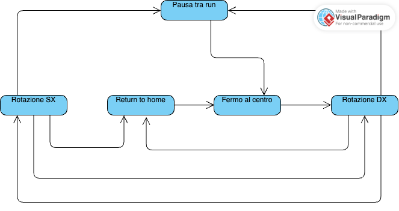

# Indice
- [Indice](#indice)
- [Definizioni](#definizioni)
- [Macchina a stati](#macchina-a-stati)
  - [Diagramma](#diagramma)
  - [Stati](#stati)
    - [**Fermo al centro**](#fermo-al-centro)
    - [**Ciclo in senso orario**](#ciclo-in-senso-orario)
    - [**Ciclo in senso antiorario**](#ciclo-in-senso-antiorario)
    - [**Pausa tra run**](#pausa-tra-run)
    - [**Ritorno al centro**](#ritorno-al-centro)

# Definizioni
- **Rotazione**: Rotazione completa della parte centrale del winder **da centro a centro**
- **Ciclo**: Insieme di *rotazioni* complete nello stesso verso che consentono la carica dell'orologio in un solo verso di rotazione
- **Run**: Insieme di *cicli* (orarie e antiorarie) che compongono un ciclo completo di carica

# Macchina a stati
## Diagramma
Il funzionamento del SW si può semplificare in una *macchina a stati* con i seguenti stati:
- Fermo al centro
- *Ciclo* in senso orario
- *Ciclo* in senso antiorario
- Pausa tra *run*
- Ritorno al centro (comandato da pulsante)

## Stati
### **Fermo al centro**
Il winder è fermo al centro in attesa di comandi
### **Ciclo in senso orario**
Il winder sta eseguendo un *ciclo* in senso orario. 
Eventi: 
- **Completamento del ciclo**: Si completa il numero di *rotazioni* che compongono il *ciclo* e si passa allo stato **Ciclo in senso antiorario**
- **Interruzione**: Viene premuto il pulsante e si passa allo stato **Ritorno al centro**

### **Ciclo in senso antiorario**
Il winder sta eseguendo un *ciclo* in senso antiorario. 
Eventi: 
- **Completamento del ciclo**: Si completa il numero di *rotazioni* che compongono il *ciclo* e si passa allo stato **Ciclo in senso orario**
- **Completamento della run**: Si completa il numero di *cicli* che compongono la *run* e si passa allo stato **Pausa tra run**
- **Interruzione**: Viene premuto il pulsante e si passa allo stato **Ritorno al centro**
### **Pausa tra run**
Il winder è fermo al centro e sta attendendo l'intervallo di tempo configurato tra una *run* e un'altra 
Eventi: 
- **Completamento attesa**: Si esaurisce l'intervallo di tempo di attesa e viene avviata una nuova *run*. Si passa allo stato **Ciclo in senso orario**
- **Interruzione**: Viene premuto il pulsante e si passa allo stato **Fermo al centro**

### **Ritorno al centro**
I winder deve ritornare al centro a causa di un evento (in questo caso, la pressione prolungata del pulsante) 
Eventi: 
- **Arrivo al centro**: Il winder viene riportato al centro si passa allo stato **Fermo al centro**
